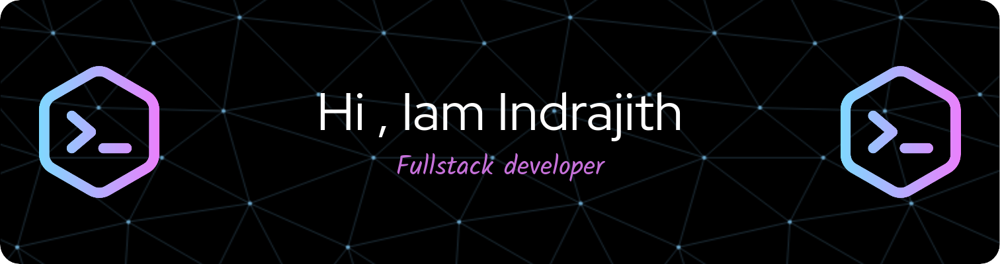

# 💫 About Me:
Full Stack Developer with a passion for building dynamic web applications

## 🌐 Socials:
 

# 💻 Tech Stack:
                                         
# 📊 GitHub Stats:
 
 

## 🏆 GitHub Trophies

### ✍️ Random Dev Quote

### 🔝 Top Contributed Repo

### 😂 Random Dev Meme

---

<!-- Proudly created with GPRM ( https://gprm.itsvg.in ) -->
